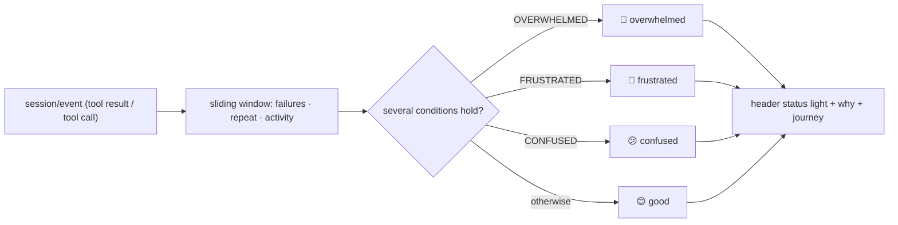

<p align="center">
  
</p>

<h1 align="center">dsh-mood</h1>

<p align="center"><strong>A tiny mood ring for your AI coding agent.</strong></p>

<p align="center">
  <a href="https://github.com/Raphaelutumn/dsh-mood/actions/workflows/ci.yml"></a>
  <a href="https://github.com/Raphaelutumn/dsh-mood/releases"></a>
  <a href="LICENSE"></a>
  
  
  <a href="https://github.com/Raphaelutumn/dsh-mood/stargazers"></a>
</p>

<p align="center"><a href="README.zh.md">中文</a></p>

> *"Your agent doesn't have feelings. But its behavior does. It's not science. It's a mood ring."*

dsh-mood watches how your AI coding agent is working — consecutive failures, repeating the same tool, activity level — and folds that into one simple four-state Mood, shown as a **low-friction status light** in the session header: doing fine 😊, confused 😕, frustrated 😤, overwhelmed 🤯.

Machine-readable project facts: [llms.txt](llms.txt)

## 30-second proof

After installing and refreshing `dsh web`, a status light appears beside the session header. Have the agent fail a few times and watch it go 😊 → 😤; a run of stable successes brings it back to 😊:

| Without dsh-mood | With `dsh-mood` |
| --- | --- |
| You guess whether the agent is fine or stuck by reading the log. | At a glance you see the current Mood, a verifiable why (e.g. `3 consecutive failures`), and the session's mood journey. |


## Why Mood?

Coding agents are good at moving quickly — and just as good at getting stuck. Consecutive failures, repeating the same call, several abnormal signals at once. While you wait, the one thing you want to know is: *does it look OK right now?*

Mood is not magic. It is an **interpretable behavior classification**. Every Mood comes from observed signals and gives you a fixed, verifiable why. It never interrupts the workflow and never pretends to measure the model's inner psychology.

| Read progress at a glance | Catch stalls | Low-friction | Kind of fun |
| --- | --- | --- | --- |
| No log reading to see if things look normal. | Repeated failures / repeated actions get a hint. | It's a status light, not a dashboard. | Four faces + a session journey you don't mind glancing at. |

## The four Moods

| Mood | Meaning | Observed signal |
| --- | --- | --- |
| 😊 **GOOD** | Everything looks fine | steady useful results, no abnormal repetition |
| 😕 **CONFUSED** | Starting to spin | repeating the same / highly similar action |
| 😤 **FRUSTRATED** | Failing visibly | a short run of clear consecutive failures |
| 🤯 **OVERWHELMED** | Out of control / overloaded | high activity + failure + repetition together |

When several hold at once, priority is: `🤯 OVERWHELMED > 😤 FRUSTRATED > 😕 CONFUSED > 😊 GOOD`. A normal, complex task is **not** flagged OVERWHELMED just for many tool calls — it requires several abnormal signals together.

## How it works



The state machine is a **pure fold**: `session/event → MoodState → MoodProjection`. The host computes it; the browser reads it directly via `useProjection('mood')`. No external dependencies, fully predictable.

## Anti-flash design

- **Upgrades are sensitive.** A failure/repeat crossing its threshold moves the Mood up immediately.
- **Recovery is conservative.** Returning to GOOD needs a few consecutive successes, so a single success doesn't make it bounce.
- **Reasons are de-duplicated.** The same reason stops re-surfacing within its cooldown window, but a real recovery or worse escalation is never hidden.
- **Session journey.** It remembers the whole trip (`😊 → 😤 → 😊`), shown on hover.

## Quick start

### Install from a Release package

```powershell
Invoke-WebRequest `
  -Uri 'https://github.com/Raphaelutumn/dsh-mood/releases/latest/download/dsh-external-dsh-mood-0.1.0.tgz' `
  -OutFile '.\dsh-mood-0.1.0.tgz'

dsh plugin --profile web add .\dsh-mood-0.1.0.tgz
```

When running from a DeepSeek Harness source checkout:

```powershell
$env:DSH_HOME='D:\Deepseek harness\.dsh'
corepack pnpm --dir 'D:\Deepseek harness' dsh plugin --profile web add .\dsh-mood-0.1.0.tgz
```

### Build from source

```powershell
git clone https://github.com/Raphaelutumn/dsh-mood.git
Set-Location .\dsh-mood
corepack pnpm install
corepack pnpm pack --pack-destination .
dsh plugin --profile web add .\dsh-external-dsh-mood-0.1.0.tgz
```

### Uninstall

```powershell
dsh plugin --profile web remove dsh-mood
```

> If you run the DeepSeek Harness monorepo directly, the two packages `@deepseek-ai/dsh-mood` (host) and `@deepseek-ai/dsh-client-mood` (client) are already wired into `dsh-base` / `dsh-web-app` and load with the default profile.

## Configuration

| Field | Default | Meaning |
| --- | ---: | --- |
| `confusedRepeatThreshold` | `3` | consecutive occurrences of one tool that mean CONFUSED |
| `frustratedFailureThreshold` | `3` | consecutive failures that mean FRUSTRATED |
| `overwhelmedSignalCount` | `3` | whether high activity + failure + repetition are all present for OVERWHELMED |
| `stableSuccessesToRecover` | `2` | consecutive successes required to return to GOOD |
| `changeCooldownMs` | `60000` | how long before the same reason stops re-surfacing |
| `repetitionWindow` | `12` | recent tool calls kept for repeat detection |
| `highActivityThreshold` | `4` | window length treated as "high activity" |

Override in the profile's `cordis.patch.yml`:

```yaml
- id: mood
  config:
    frustratedFailureThreshold: 5
    stableSuccessesToRecover: 3
    changeCooldownMs: 30000
```

All config values must be positive integers. Invalid config fails plugin load loudly rather than silently weakening behavior.

## Compatibility

| Environment | Support & verification |
| --- | --- |
| Node.js 20 / 22 / 24 | matches DeepSeek Harness |
| DeepSeek Harness | host `@deepseek-ai/dsh-mood` + client `@deepseek-ai/dsh-client-mood`; standalone `@dsh-external/dsh-mood` |
| Session header UI | `conversation.session.header.utilities` slot (right-aligned, additive, never pollutes the message flow) |

## What the model sees

Mood is a **pure observer**: it changes no model request, adds no prompt, and vetoes no tool. `ctx.mood.snapshot(session)` reads the current snapshot; `mood/change` events notify host-side consumers when the Mood changes.

## FAQ

### Does it interrupt the agent?

No. It is a read-only behavior observer — no injected prompts, no call vetoing or rewriting. The status light lives only in the session header and never touches the message flow.

### Is it rigorous science?

No. Mood is an **interpretable behavior classification**; every why comes from observed signals. It does not pretend to measure the model's mental state.

### Why does recovery need several successes?

To avoid flipping on success/failure alternation. Upgrades are sensitive, recovery is conservative — that is the core anti-flash design.

## Behavior details

- Signals are computed locally: nothing leaves the machine, no database, no dashboard.
- Recovery needs stable successes; repeated reasons are de-duplicated by cooldown; OVERWHELMED needs several signals at once.
- All thresholds are `Config`-tunable for real-task calibration.

## Limitations

- Mood reflects **behavioral signals**, not a guarantee of task progress — repeated failure isn't proof of being stuck, but the absence of failure usually means progress.
- State is in-memory only; a session restart does not persist the journey.
- **Standalone-install status.** The `@dsh-external/dsh-mood` package here builds and serves against the current DeepSeek Harness source. The DSH packages published to npm are still at `0.0.1-rc.1` and do not yet expose the web-client APIs (`conversation.session.header.utilities`, `useProjection`) this plugin uses — so a standalone `dsh plugin add` of the browser half is not yet supported against the public npm stack. It runs inside the DeepSeek Harness monorepo and with the default web profile. We will publish standalone once the public client stack catches up. See `packages/dsh-mood/README.md`.

## Contributing

Issues and clearly-scoped pull requests are welcome. Local verification:

```powershell
corepack pnpm install
corepack pnpm test
corepack pnpm typecheck
corepack pnpm build
```

Behavior must be test-backed. The project has 32 tests (host 22 + client 10).

## License

[MIT](LICENSE)
