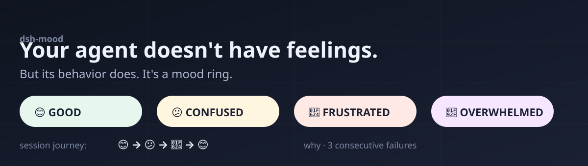
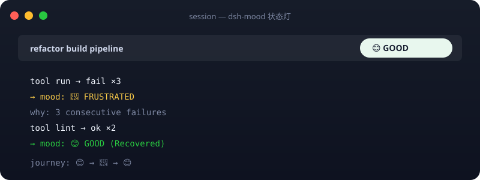
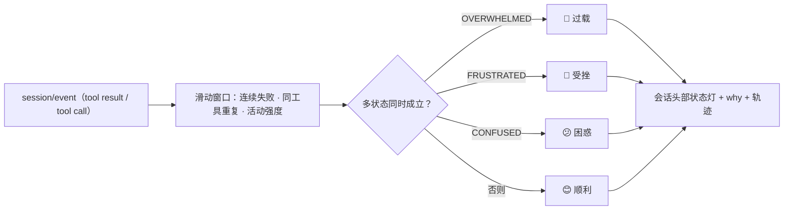

<p align="center">
  
</p>

<h1 align="center">dsh-mood</h1>

<p align="center"><strong>让正在干活的 AI 编程 Agent“会变脸”——一颗低干扰的会话头部心情指示器。</strong></p>

<p align="center">
  <a href="https://github.com/Raphaelutumn/dsh-mood/actions/workflows/ci.yml"></a>
  <a href="https://github.com/Raphaelutumn/dsh-mood/releases"></a>
  <a href="LICENSE"></a>
  
  
  <a href="https://github.com/Raphaelutumn/dsh-mood/stargazers"></a>
</p>

<p align="center"><a href="README.md">English</a></p>

> *“Your agent doesn't have feelings. But its behavior does. It's not science. It's a mood ring.”*

dsh-mood 观察 Agent 最近怎么做事——连续失败、反复执行同一个工具、活动强度——把它翻译成一个简单的四态 Mood，并在会话头部用一颗**低干扰的状态灯**呈现：顺利 😊、困惑 😕、受挫 😤、过载 🤯。

机器可读的项目事实：[llms.txt](llms.txt)

## 30 秒演示

安装后刷新 `dsh web`，会话头部右侧就会出现状态灯。让 Agent 连续失败几次，它会从 😊 变到 😤；之后连续成功它回到 😊：

| 没有 dsh-mood | 安装 `dsh-mood` 后 |
| --- | --- |
| 你只能靠翻日志猜 Agent 眼下是顺利还是卡住。 | 一眼看清当前 Mood，得到可验证的 why（如 `3 consecutive failures`）和整场会话轨迹。 |



## 为什么需要 Mood？

编码 Agent 很擅长干活，但**卡住和原地打转**同样常见：连续失败、反复执行同一个工具、多信号同时叠加。你等它时最想知道的只是一句——“它现在看起来正常吗？”

Mood 不是玄学，是**可解释的行为分类**。每个 Mood 都来自真实观察到的信号，给你一个固定、可验证的 why。它不打断工作流，也不假装测量模型的心理。

| 一眼看懂进展 | 抓住卡死 | 低干扰 | 有点好玩 |
| --- | --- | --- | --- |
| 不用翻日志就知道现在是否正常。 | 连续失败 / 反复同一操作会给出提示。 | 它是状态灯，不是监控面板。 | 四态表情 + 会话轨迹，让你乐意看一眼。 |

## 它认识四种 Mood

| Mood | 含义 | 观察到什么 |
| --- | --- | --- |
| 😊 **GOOD** | 一切正常 | 持续有效结果，无明显异常重复 |
| 😕 **CONFUSED** | 开始原地打转 | 反复执行相同 / 高度相似的操作 |
| 😤 **FRUSTRATED** | 连挂很明显 | 短时间连续明确失败 |
| 🤯 **OVERWHELMED** | 失控 / 过载 | 高活动 + 失败 + 重复等信号同时出现 |

多状态同**时成立时**的优先级：`🤯 OVERWHELMED > 😤 FRUSTRATED > 😕 CONFUSED > 😊 GOOD`。正常的高复杂度任务**不会**因为工具调用多就被误判为 OVERWHELMED——它需要多重异常信号同时命中。

## 工作原理



状态机是**纯 fold**：`session/event → MoodState → MoodProjection`。宿主侧计算，浏览器经 `useProjection('mood')` 直接读结果，无外部依赖、可预测。

## 防闪烁设计

- **升级很敏感**：连续失败 / 重复一达阈值立刻升到对应 Mood。
- **恢复很保守**：回到 GOOD 需要**连续几次成功**，单个成功不会让它来回跳。
- **原因去重**：同一原因在冷却窗口内不再刷屏，但真正的恢复 / 升级不会被吞掉。
- **会话轨迹**：它记住整场的旅行（`😊 → 😤 → 😊`），悬停即可回看。

## 快速开始

### 从 Release 包安装

```powershell
Invoke-WebRequest `
  -Uri 'https://github.com/Raphaelutumn/dsh-mood/releases/latest/download/dsh-external-dsh-mood-0.1.0.tgz' `
  -OutFile '.\dsh-mood-0.1.0.tgz'

dsh plugin --profile web add .\dsh-mood-0.1.0.tgz
```

从 DeepSeek Harness 源码 checkout 运行时：

```powershell
$env:DSH_HOME='D:\Deepseek harness\.dsh'
corepack pnpm --dir 'D:\Deepseek harness' dsh plugin --profile web add .\dsh-mood-0.1.0.tgz
```

### 从源码构建

```powershell
git clone https://github.com/Raphaelutumn/dsh-mood.git
Set-Location .\dsh-mood
corepack pnpm install
corepack pnpm pack --pack-destination .
dsh plugin --profile web add .\dsh-external-dsh-mood-0.1.0.tgz
```

### 卸载

```powershell
dsh plugin --profile web remove dsh-mood
```

> 若你直接使用 DeepSeek Harness monorepo，两个包 `@deepseek-ai/dsh-mood`（宿主）与 `@deepseek-ai/dsh-client-mood`（客户端）已注册进 `dsh-base` / `dsh-web-app`，随默认 profile 一并加载。

## 配置

| 字段 | 默认值 | 含义 |
| --- | ---: | --- |
| `confusedRepeatThreshold` | `3` | 同一工具连续出现多少次判定 CONFUSED |
| `frustratedFailureThreshold` | `3` | 连续失败多少次判定 FRUSTRATED |
| `overwhelmedSignalCount` | `3` | 高活动 + 失败 + 重复三信号是否齐备判定 OVERWHELMED |
| `stableSuccessesToRecover` | `2` | 回到 GOOD 所需连续成功数 |
| `changeCooldownMs` | `60000` | 同一原因在多少毫秒内不重复刷屏 |
| `repetitionWindow` | `12` | 用于重复检测的最近工具调用数 |
| `highActivityThreshold` | `4` | 窗口内工具调用数多少视为“高活动” |

在 profile 的 `cordis.patch.yml` 中覆盖插件配置：

```yaml
- id: mood
  config:
    frustratedFailureThreshold: 5
    stableSuccessesToRecover: 3
    changeCooldownMs: 30000
```

所有配置都必须是正整数。非法配置会直接导致插件加载失败，而不是静默失效。

## 兼容性

| 环境 | 支持和验证情况 |
| --- | --- |
| Node.js 20 / 22 / 24 | 与 DeepSeek Harness 一致 |
| DeepSeek Harness | 宿主 `@deepseek-ai/dsh-mood` + 客户端 `@deepseek-ai/dsh-client-mood`；独立包 `@dsh-external/dsh-mood` |
| 会话头部 UI | `conversation.session.header.utilities` 槽位（右对齐、加性、不污染消息流） |

## 模型看到的提示

Mood 是**纯观察者**：它不修改任何模型请求、不加 prompt、不拦截工具。`ctx.mood.snapshot(session)` 读取当前快照；`mood/change` 事件在 Mood 变化时通知宿主侧消费者。

## 常见问题

### 它会打断 Agent 吗？

不会。它是只读行为观察者，不插入提示、不否决/改写工具调用。状态灯只出现在会话头部，不污染消息流。

### 它是严格的科学测量吗？

不是。Mood 是**可解释的行为分类**，每个 why 都来自实际观察到的信号；它不假装测量模型的心理状态。

### 为什么恢复要连续几次成功？

为了避免在成功/失败交替时频繁闪烁。升级要敏感，恢复要保守，这是 PRD 的核心防闪烁设计。

## 行为细节

- 信号完全本地计算，不发外部、无数据库、无 Dashboard。
- 恢复需连续成功；重复原因有冷却去重；多信号同时命中才 OVERWHELMED。
- 阈值全部可用 `Config` 按真实任务校准。

## 限制

- Mood 反映的是**行为信号**，不是任务进度的保证——持续失败未必等于卡死，但没有失败通常说明在推进。
- 当前是运行时内存状态，会话重启不持久化。
- **独立安装状态**：这里的 `@dsh-external/dsh-mood` 包基于当前 DeepSeek Harness 源码构建并运行。但发布到 npm 的 DSH 包仍停留在 `0.0.1-rc.1`，尚未包含本插件依赖的 Web 端 API（`conversation.session.header.utilities`、`useProjection`）——因此在公开 npm 栈上，浏览器端的独立 `dsh plugin add` 安装暂不可行。它在 DeepSeek Harness monorepo 内运行、随默认 web profile 载入。待公开客户端栈追上后会再发布独立包。参见 `packages/dsh-mood/README.md`。

## 参与贡献

欢迎提交 Issue 和边界清晰的 Pull Request。本地验证命令：

```powershell
corepack pnpm install
corepack pnpm test
corepack pnpm typecheck
corepack pnpm build
```

请确保行为描述有测试支撑。本项目共 32 个测试（宿主 22 + 客户端 10）。

## 许可证

[MIT](LICENSE)
